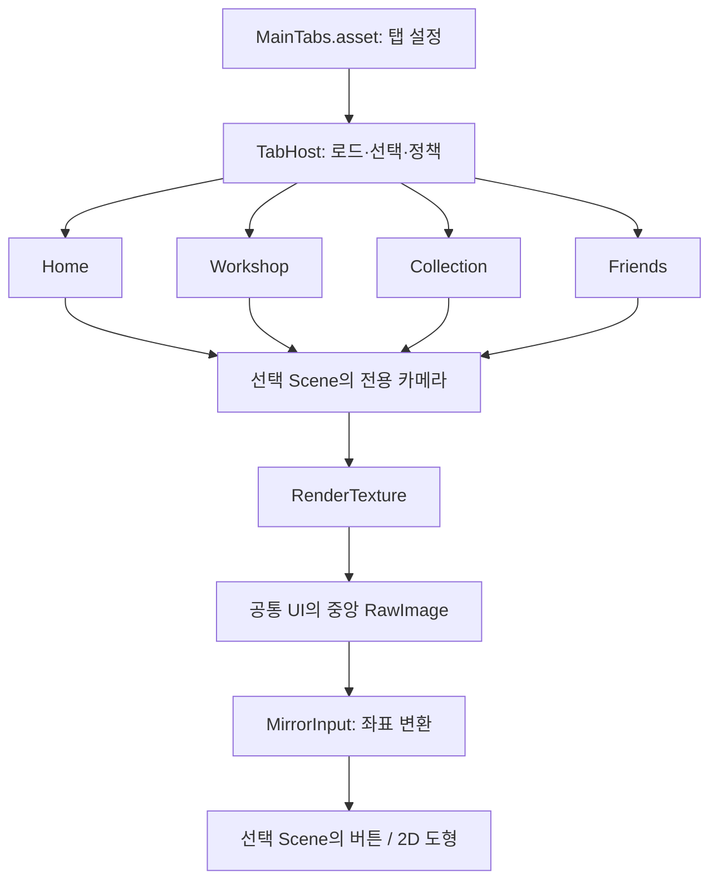

IMPLEMENTATION REPORT · 2026.09.18

# 모바일 2D 게임 UI 시제품 구현 보고서

공통 UI를 유지하면서, 탭마다 다른 Scene의 실시간 화면을 보여주고 그 안의 버튼과 사각형을 조작하도록 구현했습니다.

이 문서는 프로젝트를 처음 전달받은 사람을 위한 설명서입니다. 먼저 실행해 보고, 화면이 만들어지는 원리를 이해한 뒤, 탭·애셋·프로필·콘텐츠 Scene을 직접 바꿀 수 있는 순서로 구성했습니다.

대상 프로젝트: `D:\프로젝트\c3\Mobile2DUIPrototype`  
Unity 6.3 LTS · 6000.3.14f1 / uGUI 2.0.0 / C# / 작성 기준: 현재 프로젝트 코드와 저장된 Windows 검증 결과

**1 + 4 Scenes**  
공통 화면 1개 + 탭별 콘텐츠 4개

**실시간 표시 + 입력**  
RenderTexture 영상과 좌표 변환

**28개 통과**  
Windows 자동 검증 · 실기기 검증은 별도

## 01. 무엇을 만들었는가

출발점은 사용자가 제공한 전시관 홈 이미지입니다. 이미지 바깥의 제목, 회색 여백, 둥근 기기 테두리는 설명용이므로 앱에서 제외했습니다. 화면 안의 상단 프로필, 넓은 중앙 영역, 하단 탭 배치를 기준으로 삼았고, 일러스트와 아이콘은 사각형·색상·문자로 대체했습니다.

| 확정한 요구사항 | 현재 구현 |
| --- | --- |
| 하단 탭 | 홈·작업대·도감·친구. 최초 선택은 홈. 탭 개수, 순서, 이름, 그림, 연결 Scene을 설정 파일에서 변경합니다. |
| 상단 닉네임바 | 홈에서만 표시합니다. 닉네임·연속 일수·프로필 그림을 데이터 공급 객체로부터 받습니다. |
| 중앙 Scene 미러링 | 별도로 실행되는 Scene의 카메라 영상을 중앙에 표시합니다. 활성 탭의 움직임을 실시간으로 볼 수 있습니다. |
| 최소 입력 기능 | 마우스 또는 단일 터치에 대응하는 포인터 누르기·놓기·클릭·드래그 전달을 구현했습니다. |
| 탭을 떠난 뒤의 동작 | 기본값은 상태 유지와 계속 실행입니다. 탭별로 숨김 중 일시정지 또는 재방문 시 재시작을 선택합니다. |
| 개발용 조작 | Inspector에서 실행 정책을 선택하고, 현재 Scene을 즉시 재시작할 수 있습니다. |
| 더미 콘텐츠 | 탭마다 움직이는 도형, 드래그 도형, 터치 횟수 버튼을 둔 Scene을 제공합니다. |

**현재 결과물의 목적**   
이 시제품은 이후 게임 콘텐츠를 넣을 수 있는 UI와 Scene 연결 기반입니다. 서버 연결, 로그인, 실제 도감·친구 기능, 앱 종료 후 저장은 아직 포함하지 않습니다.

## 02. 실제 화면 읽기

아래 그림은 실제 Windows 개발 빌드에서 저장한 화면입니다. 중앙 제목·설명·도형·터치 버튼은 미러링과 입력을 확인하기 위한 더미 콘텐츠입니다. 프로필과 하단 탭은 공통 UI에 속합니다.


**홈** 프로필을 표시합니다. 하단 홈 탭의 윗줄과 글씨로 선택 상태를 나타냅니다.


**작업대** 프로필 자리를 중앙 Scene이 채웁니다. 탭바 위치는 유지됩니다.


**도감** 별도 Scene과 자체 카운터를 사용합니다.


**친구** 다른 탭과 같은 입력 연결 구조를 사용합니다.

그림의 터치 횟수는 자동 검증 과정에서 누른 결과입니다. 우측 하단의 Development Build 표시는 Unity 개발 빌드 표시이며, 설계한 게임 UI 요소가 아닙니다. 캡처는 정지 이미지지만 실제 실행에서는 진한 사각형이 움직입니다.

## 03. 처음 실행해 보기

**1 — 프로젝트 열기**  
Unity Hub에서 프로젝트 추가 기능을 사용해 `D:\프로젝트\c3\Mobile2DUIPrototype` 폴더를 선택합니다. Editor 버전은 `6000.3.14f1`입니다.

**2 — 시작 Scene 열기**  
Unity 상단 메뉴에서 `Prototype → Open UI Prototype`을 선택합니다. 공통 Scene과 세로형 Game 뷰 프리셋이 열립니다. 또는 Project 창에서 `Assets/Scenes/UIPrototype.unity`를 더블클릭합니다.

**3 — Play 실행**  
상단 ▶ 버튼을 누릅니다. 시작할 때 네 콘텐츠 Scene이 순서대로 로드됩니다. 로드가 끝나면 홈이 표시되고 탭을 누를 수 있습니다. 개별 콘텐츠 Scene 대신 반드시 `UIPrototype`에서 시작하세요.

**4 — 입력 확인**  
옅은 사각형을 마우스로 잡아 움직이고, 중앙의 `터치` 버튼을 누릅니다. 진한 사각형은 자동으로 움직입니다. 하단 작업대 탭을 선택하면 상단 프로필이 사라지고 다른 Scene이 표시됩니다.

**5 — 상태 유지 확인**  
홈에서 버튼을 몇 번 누르고 도형을 옮긴 뒤 다른 탭을 방문합니다. 홈으로 돌아오면 카운터와 옮긴 도형 위치가 유지되어야 합니다.

Game 뷰가 잘리면 상단 `Scale`을 낮춰 전체 화면이 보이게 하세요. 프로젝트 파일을 수정할 때는 먼저 Play를 종료하는 것을 기본 절차로 삼습니다.

**초기 생성 메뉴는 다시 실행할 필요가 없습니다.**   
`Generate Initial Demo (replaces demo scenes)`는 최초 씬 제작용 도구입니다. 실행하면 더미 Scene과 탭 설정을 다시 작성하므로, 기존 내용을 편집한 뒤에는 사용하지 마세요.

## 04. 먼저 알아둘 용어

| 용어 | 처음 보는 사람을 위한 설명 | 이 프로젝트에서의 예 |
| --- | --- | --- |
| Scene | 카메라, 도형, UI와 실행 코드를 담아 저장하는 작업 단위입니다. | Home.unity, Workshop.unity |
| GameObject / Component | 오브젝트는 구성 요소를 담는 대상이며, 컴포넌트는 거기에 붙는 기능입니다. | 사각형 오브젝트 + 그리기·충돌·드래그 컴포넌트 |
| Hierarchy / Inspector | Hierarchy는 현재 Scene의 오브젝트 목록입니다. Inspector는 선택한 대상의 설정을 보여줍니다. | Tab Host 선택 후 연결 정보 확인 |
| Canvas / uGUI | 버튼과 글자를 배치하는 UI 영역과 그 UI 시스템입니다. | 공통 상단·하단 UI |
| RectTransform / Anchor | UI의 위치·크기와 부모 영역의 어느 지점에 붙일지 정하는 설정입니다. | 탭바를 화면 아래쪽에 붙이기 |
| Sprite | UI나 2D 오브젝트에 사용할 이미지 애셋입니다. | 프로필 그림, 탭 아이콘 |
| ScriptableObject | 설정 데이터를 별도 파일로 저장해 여러 코드에서 참조하게 하는 방식입니다. | MainTabs.asset |
| Additive 로드 | 기존 Scene을 유지한 채 다른 Scene을 추가로 메모리에 올리는 방식입니다. | 공통 UI와 네 콘텐츠 Scene을 함께 로드 |
| RenderTexture / RawImage | RenderTexture는 카메라가 그린 화면을 담는 이미지 버퍼, RawImage는 그 버퍼를 UI에서 보여주는 요소입니다. | 중앙 Scene Mirror |
| Raycast / Collider | 누른 위치의 대상을 찾는 검사와, 도형의 선택·충돌 영역입니다. | UI 버튼 검사 후 2D 사각형 검사 |

## 05. 전체 구조와 실행 순서

공통 Scene인 `UIPrototype`이 화면의 틀을 소유합니다. 각 콘텐츠 Scene은 자신의 도형·버튼·카메라를 소유합니다. 두 부분 사이를 `TabHost`가 연결합니다.



예를 들어 작업대 탭을 선택하면, 화면 전체를 새 Scene으로 교체하지 않습니다. 공통 UI는 유지하고, 중앙 RawImage가 참조하는 이미지와 입력 전달 대상을 작업대 Scene으로 바꿉니다.

### 처음 Play를 누르면

1. `TabHost.Start()`가 탭 설정을 검사합니다. ID 중복, Scene 경로 중복, 빌드 목록 누락 등을 확인합니다.
2. 설정 목록의 길이에 맞춰 하단 버튼을 생성합니다. 버튼은 로딩 중 비활성 상태입니다.
3. 초기 탭의 프로필 표시 여부에 맞춰 중앙 영역을 계산합니다.
4. 네 콘텐츠 Scene을 순서대로 Additive 로드합니다. 각 Scene에 별도 2D 물리 공간을 요청합니다.
5. 각 Scene의 최상위 `MirrorSceneRoot`를 찾아 레이어, 카메라, RenderTexture, UI 검사기를 연결합니다.
6. 로드가 끝나면 홈을 선택하고, 홈 카메라와 입력 전달을 활성화합니다.

모든 콘텐츠 Scene을 처음부터 로드하는 것은 ‘방문하지 않은 탭도 기본적으로 실행 상태를 유지한다’는 현재 설계에 맞춘 선택입니다. Scene이 무거워지면 초기 대기 시간과 메모리를 줄이기 위한 로드 전략을 별도로 검토해야 합니다.

### Hierarchy에서 보게 되는 구조

```
UIPrototype
├─ Shell Camera                 배경과 공통 AudioListener
├─ EventSystem                  공통 포인터 입력 처리
├─ App UI                       화면 위에 그리는 공통 Canvas
│  ├─ Background
│  └─ Safe Area
│     ├─ Scene Mirror           RawImage + MirrorInput
│     ├─ Home Profile           ProfileBar
│     ├─ Bottom Toolbar
│     │  └─ Tabs                Play 시 목록에서 버튼 생성
│     └─ Loading Status
├─ Profile Data (dummy publisher)
├─ Tab Host
└─ Verification (command line only)

Home / Workshop / Collection / Friends    Play 시 추가로 로드
└─ Mirror Scene Root
   ├─ Mirror Camera
   ├─ Scene UI                  제목·설명·터치 버튼
   ├─ Moving Square
   └─ Drag Square
```

## 06. 하단 탭과 교체 가능한 애셋

탭 정보는 `Assets/Configuration/MainTabs.asset`에 저장했습니다. 이 파일은 `TabCatalog` 타입이며, 내부의 `Tabs` 목록 한 항목이 탭 하나를 뜻합니다.

`TabHost.BuildToolbar()`는 목록 길이로 전체 가로 폭을 나눕니다. 탭이 4개이면 각각 25%, 5개이면 각각 20%를 차지합니다. 선택된 탭은 위쪽 표시선, 진한 글씨, 굵은 글씨로 구별합니다. 기본 아이콘은 비어 있으며, 아이콘을 넣으면 텍스트가 아래쪽으로 이동합니다.

| Inspector 항목 | 무엇을 바꾸는가 | 사용 예 |
| --- | --- | --- |
| Id / Title | 내부 식별자 / 사용자가 읽는 이름 | Workshop / 작업대 |
| Scene Path | 탭과 연결할 Scene | Workshop.unity를 필드에 드래그 |
| Show Profile | 상단 프로필 표시 여부 | 홈만 체크 |
| Icon | 탭 아이콘 Sprite | 집 그림으로 홈 아이콘 교체 |
| Background / Selected Background | 일반 / 선택 상태의 배경 이미지 | 선택 때만 다른 버튼 배경 사용 |
| Selection Marker / Marker Color | 선택 표시선 이미지와 색 | 표시선을 녹색에서 파란색으로 변경 |
| Normal Color / Selected Color | 일반 / 선택 상태의 문구 색 | 회색 / 진한 청록색 |
| Background Policy | 다른 탭으로 이동한 뒤 실행 방식 | Continue Running |
| Initial Tab | 시작할 탭의 목록 인덱스. 첫 항목은 0 | 0 = 홈 |
| Font / Surface | 탭에 사용하는 글꼴 / 기본 배경색 | 일반 배경 이미지가 없을 때 Surface 사용 |
| Maximum Texture Width | Scene 영상의 최대 가로 해상도 | 기본값 1080 |

`ScenePathDrawer`가 Scene Path를 파일 선택 필드로 보여줍니다. 내부 저장값은 `Assets/Scenes/Home.unity` 같은 경로 문자열이므로, Inspector에서 경로를 직접 타이핑하지 않아도 됩니다.

**어디까지 가변인가?**   
탭 개수·순서·연결 Scene·애셋을 바꿀 수 있습니다. 탭 구조를 실행 중 동적으로 추가하는 기능은 이번 범위에 넣지 않았습니다. 개수·순서·Scene 변경은 Play를 종료한 상태에서 하고, 다시 실행해 반영합니다. 실행 정책은 Play 중 변경할 수 있습니다. TabCatalog는 저장 애셋이므로 Play 중 편집한 설정도 남을 수 있습니다.

현재 Sprite가 비어 있는 항목은 기본 색상과 사각형으로 그립니다. 선택 배경만 비어 있으면 일반 배경으로 대체합니다. 중앙 사각형의 애셋은 탭 카탈로그가 아니라 각 콘텐츠 Scene의 SpriteRenderer에서 교체합니다.

## 07. 프로필 데이터와 표시의 분리

닉네임을 화면의 Text에 직접 고정해 두면, 나중에 로그인이나 저장 데이터를 붙일 때 화면 코드까지 다시 고쳐야 합니다. 이를 줄이기 위해 ‘데이터를 주는 부분’과 ‘데이터를 그리는 부분’을 분리했습니다.

**ProfileData**  
nickname  
consecutiveDays  
avatar

→

**ProfileDataSource**  
현재 데이터 보관  
SetProfile()로 교체  
Changed 이벤트 발행

→

**ProfileBar**  
이벤트를 받아  
이름·일수·이미지 표시

현재 공급 객체의 기본값은 닉네임 `닉네임`, 연속 일수 `12`, 프로필 이미지 없음입니다. 이미지가 없으면 옅은 사각형을 표시합니다. 오른쪽 별표는 아직 동작 없는 자리 표시자입니다.

새 데이터가 준비되면 공급 객체에 다음처럼 전달합니다. 아래 코드는 호출 예시이며, `source`는 Scene의 ProfileDataSource 참조이고 `profileSprite`는 이미 준비된 Sprite입니다.

```
using MobilePrototype;

source.SetProfile(new ProfileData {
    nickname = "새로운 플레이어",
    consecutiveDays = 7,
    avatar = profileSprite
});
```

프로필 바가 활성화되면 변경 이벤트를 구독하고 현재 데이터를 즉시 읽습니다. 숨겨지면 구독을 해제합니다. 따라서 다른 탭을 보고 있는 동안 데이터가 변경되어도, 홈으로 돌아오는 순간 최신 데이터가 표시됩니다.

실제 연속 접속 일수를 계산하거나 서버에서 아바타 이미지를 다운로드하는 코드는 아직 없습니다. 나중에 그 처리를 담당하는 코드가 결과를 `SetProfile()`에 전달하면 됩니다.

## 08. Scene을 중앙에 보여주는 원리

각 콘텐츠 Scene에는 전용 카메라가 있습니다. 카메라의 출력 대상을 화면 자체가 아니라 `RenderTexture`로 지정하고, 공통 UI의 `RawImage`가 그 텍스처를 보여줍니다.

**① 콘텐츠 Scene**  
도형이 움직이고  
UI와 상태가 갱신됨

→

**② 전용 Camera**  
자신에게 할당된  
레이어만 촬영

→

**③ RenderTexture**  
카메라 영상을  
이미지 버퍼에 기록

→

**④ RawImage**  
중앙 영역에  
그 버퍼를 표시

이 연결의 핵심은 다음 두 줄입니다. 실제 코드에서는 Scene 로드와 연결 검사를 마친 뒤 실행합니다.

```
sceneCamera.targetTexture = texture;
mirror.texture = texture;
```

카메라가 활성화되어 있는 동안 영상이 갱신되므로 Scene 안에서 이동·회전·애니메이션·UI 변화가 발생하면 중앙 화면에도 반영됩니다. 목표 프레임률은 60으로 설정했지만, 실제 60fps 달성 여부를 모바일 기기에서 측정한 것은 아닙니다.

### 탭을 바꾸면

1. 기존 중앙 입력을 취소해 누름·드래그 상태를 정리합니다.
2. 이전 Scene의 카메라는 끄고, 새 Scene의 카메라만 켭니다.
3. 설정된 정책에 따라 각 Scene을 실행하거나 정지합니다.
4. 프로필 표시와 중앙 영역 높이를 조정합니다.
5. RawImage가 참조하는 RenderTexture와 MirrorInput의 대상을 새 Scene으로 변경합니다.
6. 선택된 탭의 표시선을 갱신합니다.

**숨겨진 Scene의 실행과 영상 갱신은 서로 다릅니다.**  기본 정책에서는 숨겨진 Scene의 코드와 2D 물리는 계속 실행하지만, 카메라 렌더링은 생략합니다. 다시 선택하면 그 시점의 상태를 촬영합니다. 숨겨진 탭의 RenderTexture를 동시에 실시간 썸네일로 제공하는 구조는 아닙니다.

### 서로 다른 Scene의 도형이 섞이지 않는 이유

| 분리 대상 | 구현 방식 | 효과 |
| --- | --- | --- |
| 보이는 오브젝트 | 탭마다 레이어 8 + 탭 인덱스를 할당하고 카메라의 Culling Mask를 제한 | 같은 좌표에 있는 다른 Scene의 사각형이 함께 보이지 않음 |
| 2D 충돌 공간 | 로드 시 LocalPhysicsMode.Physics2D 지정 | 각 Scene의 2D 물리 공간을 분리 |
| 물리 시간 진행 | TabHost.FixedUpdate에서 각 로컬 PhysicsScene2D를 Simulate | 정지한 Scene만 물리 진행을 건너뜀 |
| UI 입력 | 콘텐츠의 GraphicRaycaster는 자동 처리에서 제외하고, 입력 브리지가 선택된 Scene만 검사 | 보이지 않는 다른 탭의 버튼으로 입력이 전달되는 것을 방지 |

Scene UI는 `Screen Space - Camera` Canvas로 만들고 해당 Scene 카메라를 연결했습니다. `Screen Space - Overlay`는 카메라를 거치지 않기 때문에, 중앙에 미러링할 콘텐츠 UI에는 사용하지 않습니다. 공통 상단·하단 UI는 Overlay를 사용합니다.

## 09. 영상 안의 버튼과 도형을 누르는 원리

RawImage는 본래 이미지를 보여주는 요소입니다. 그 위를 누르는 것만으로 영상 속 버튼이 눌리지는 않습니다. 그래서 중앙 영역에 `MirrorInput`이라는 입력 전달 컴포넌트를 붙였습니다.

### 좌표를 바꾸는 과정

예를 들어 중앙 영상이 실제 화면에서 가로 540, 세로 800만큼 보이고, 원본 RenderTexture가 가로 1080, 세로 1600이라고 가정하겠습니다. 중앙 영역 안에서 왼쪽으로부터 135, 아래로부터 200인 곳을 눌렀다면, 원본 영상에서는 270, 400 위치를 누른 것과 같습니다. 아래 수치는 원리 설명용 예시이며 현재 기기의 고정 크기가 아닙니다.

```
u = 중앙 영역 왼쪽부터의 거리 ÷ 중앙 영역 너비
v = 중앙 영역 아래쪽부터의 거리 ÷ 중앙 영역 높이

영상 안의 x = u × RenderTexture 너비
영상 안의 y = v × RenderTexture 높이

예: u = 135 ÷ 540 = 0.25
    v = 200 ÷ 800 = 0.25
    영상 좌표 = (270, 400)
```

실제 구현의 `MapPosition()`은 RectTransform 좌표로 먼저 바꾼 다음 이 비율을 계산합니다. 그래서 프로필이 사라지거나 창 크기가 바뀌어도 같은 원리로 입력 위치를 맞춥니다.

### 대상을 찾는 순서

1. 선택된 Scene의 UI 검사기인 GraphicRaycaster에 영상 좌표를 전달합니다.
2. UI가 있다면 표시 순서와 깊이를 비교해 대상 하나를 고릅니다.
3. UI가 없으면 카메라에서 해당 위치로 향하는 선을 만들고 z=0 평면과 만나는 좌표를 구합니다.
4. 해당 Scene의 2D 물리 공간에서 그 지점에 있는 Collider를 찾습니다.
5. 대상의 포인터·드래그 인터페이스에 Unity 이벤트를 전달합니다.

UI 검사를 먼저 하므로 버튼을 누른 입력이 뒤쪽 도형 선택으로 바로 이어지지 않습니다. 텍스트와 장식 이미지의 `Raycast Target`은 꺼서 입력을 불필요하게 가로채지 않게 했습니다.

### 누르기와 드래그의 구분

처음 누른 포인터 하나를 기억하고, 놓을 때까지 그 포인터만 처리합니다. 드래그가 시작되면 클릭 자격을 취소합니다. 단순 클릭은 누른 대상과 놓은 대상의 클릭 처리기가 같을 때만 발생합니다. 탭 변경·해상도 변경·앱 포커스 상실 때는 진행 중인 입력을 취소합니다.

`DemoDraggable`은 최초에 누른 위치와 도형 중심의 차이를 기억해 도형이 갑자기 손가락 중심으로 튀지 않게 합니다. 드래그 중에는 좌표를 갱신하고 카메라 화면 범위 안으로 제한합니다.

**임의의 콘텐츠를 연결하기만 하면 모든 입력이 자동 지원되는 것은 아닙니다.**   
이번 구현은 단일 포인터 이벤트 전달입니다. 새 오브젝트는 `IPointerDownHandler`, `IDragHandler` 등의 인터페이스로 입력을 받아야 합니다. 자체적으로 전역 `Input`을 읽는 스크립트, 멀티터치, 텍스트 입력, 키보드 탐색, 휠·호버·드롭은 별도 연결이 필요합니다.

## 10. 계속 실행·일시정지·재시작

실행 정책은 각 탭의 `Background Policy`에서 정합니다. 앱 전체 시간 배율인 `Time.timeScale`을 바꾸지 않고, 해당 Scene에만 적용합니다.

| 정책 | 탭을 떠나면 | 다시 돌아오면 | 적합한 예 |
| --- | --- | --- | --- |
| Continue Running 기본값 | 루트는 활성 상태. 코드와 2D 물리가 계속 진행. 카메라만 꺼짐. | 그동안 진행된 현재 상태를 표시 | 다른 화면에서도 진행할 작업 |
| Pause While Hidden | 콘텐츠 루트를 비활성화하고 로컬 2D 물리 진행 중단 | 같은 오브젝트를 다시 활성화. 카운터·좌표 유지 | 보는 동안에만 진행할 미니게임 |
| Restart On Return | 숨겨진 동안 정지 | 이미 방문한 Scene이면 언로드·재로드하여 새 인스턴스로 시작 | 들어갈 때마다 초기화할 체험 화면 |

Hierarchy에서 `Tab Host`를 선택하면 Inspector에 `Restart Current Scene Now` 버튼이 나타납니다. Play 중 로딩이 끝난 상태에서 눌러 현재 Scene만 재시작할 수 있습니다. 사용자가 보는 게임 화면에는 개발용 버튼을 넣지 않았습니다.

이미 선택된 탭을 다시 누르는 동작은 아무것도 초기화하지 않습니다. 재시작 중 다른 탭을 선택하면 마지막 요청을 기억했다가 로드가 끝난 뒤 적용합니다.

### ‘상태 유지’의 정확한 범위

상태 유지란 실행 중인 Scene 인스턴스를 메모리에 남기는 방식입니다. 카운터를 파일에 기록해서 복구하는 저장 시스템이 아닙니다. Play를 종료하거나 앱을 종료한 뒤 다시 켜면 초기 상태에서 시작합니다.

일시정지에서는 루트의 `SetActive(false)`가 사용되므로 `OnDisable`과 `OnEnable`이 호출됩니다. 중단된 코루틴을 같은 지점에서 자동 재개하거나, 시스템 시계·네트워크 작업까지 정지시키지는 않습니다. 이 시제품의 움직임은 `deltaTime`을 누적해 계산하므로 일시정지 실험에 맞게 동작합니다.

재시작은 그 Scene의 오브젝트를 다시 만드는 것입니다. 정적 변수, `DontDestroyOnLoad` 객체, 파일·서버 데이터는 별도 초기화가 필요합니다.

## 11. 화면 크기와 Safe Area 대응

공통 Canvas는 `Scale With Screen Size`를 사용하며 기준 해상도는 1080×1920, 크기 맞춤 기준은 가로 폭입니다. 여기서 기준 해상도는 배치 계산 기준이며 실제 기기 출력 해상도를 고정하는 설정이 아닙니다.

| 항목 | 설정과 처리 |
| --- | --- |
| 상단·하단 높이 | 기준 UI 단위로 상단 178, 하단 124. 홈 중앙 영역은 위 178·아래 124를 비우고, 다른 탭은 위쪽 여백을 0으로 변경합니다. |
| Safe Area | Screen.safeArea를 화면 크기로 나누어 안전 영역 RectTransform의 Anchor에 반영합니다. 배경은 화면 전체를 채우고 주요 UI는 그 안에 배치합니다. |
| 미러 영상 해상도 | 중앙 영역 크기와 비율에 맞춰 RenderTexture를 생성합니다. 기본 최대 가로는 1080, 세로 계산값의 상한은 4096입니다. |
| 화면 크기 변화 | 계산된 텍스처 크기가 바뀌면 기존 텍스처를 해제하고 다시 생성·연결합니다. 진행 중인 입력은 취소합니다. |
| 방향 | 모바일 설정은 세로 방향을 기준으로 구성했습니다. Windows 검증용 창은 크기를 변경할 수 있습니다. |


480×1040 · 긴 세로 화면


768×1024 · 넓은 세로 화면

넓은 화면 전용으로 콘텐츠를 재배열하는 태블릿 UI는 따로 만들지 않았습니다. 극단적인 화면 비율에서는 텍스처 크기 제한에 대한 추가 설계도 필요합니다. 실제 노치·홈 인디케이터가 있는 Android/iOS 기기의 Safe Area 동작은 아직 실기기로 검증하지 않았습니다.

## 12. 직접 바꿔보는 따라 하기

### A. ‘작업대’라는 이름과 탭 색 바꾸기

1. Play를 종료합니다.
2. Project 창에서 `Assets → Configuration → MainTabs`를 선택합니다.
3. Inspector의 `Tabs` 목록에서 Id가 `Workshop`인 항목을 펼칩니다.
4. `Title`을 `공방`으로 바꾸고 `Marker Color`를 원하는 색으로 바꿉니다.
5. Play를 실행하고 공방 탭을 선택합니다. 하단 문구와 선택선 색이 바뀌어야 합니다.

중앙의 ‘나만의 작업대’ 제목은 Workshop Scene 안의 Text입니다. 탭 이름을 바꾸는 것과 콘텐츠 제목을 바꾸는 것은 별개의 수정입니다.

### B. 아이콘 넣기

1. PNG 이미지 파일을 Project 창의 `Assets/Art`에 넣습니다.
2. 그 이미지를 선택하고 Texture Type을 `Sprite (2D and UI)`로 지정한 뒤 Apply합니다.
3. MainTabs에서 해당 탭의 `Icon` 필드에 이미지를 끌어놓습니다.
4. 다시 Play하면 아이콘이 표시되고 문구가 아래쪽에 배치됩니다. Icon을 비우면 문구 중심의 기본 형태로 돌아갑니다.

### C. 더미 프로필 바꾸기

1. `UIPrototype` Scene을 엽니다.
2. Hierarchy에서 `Profile Data (dummy publisher)`를 선택합니다.
3. Profile Data Source 컴포넌트의 Profile 항목에서 Nickname, Consecutive Days, Avatar를 수정합니다.
4. Play 후 홈에서 변경값을 확인합니다. 실제 서비스 연결 시에는 앞서 설명한 SetProfile()을 사용합니다.

### D. 다섯 번째 탭 추가하기

1. Play를 종료합니다. Project 창에서 `Workshop.unity`를 복제해 `Garden.unity`로 이름을 바꿉니다.
2. Garden Scene을 열고 `Mirror Scene Root → Scene UI → Heading`의 Text를 `정원`으로 바꿉니다. 원하는 경우 두 사각형의 SpriteRenderer 색도 바꿉니다. 저장합니다.
3. MainTabs의 Tabs 목록 크기를 하나 늘립니다. 새 항목을 추가할 때 기존 항목의 값이 복사되면 ID와 Scene을 반드시 다시 지정합니다.
4. 새 항목을 `Id = Garden`, `Title = 정원`, `Scene Path = Garden.unity`, `Show Profile = 꺼짐`, `Background Policy = Continue Running`으로 설정합니다.
5. `Prototype → Sync Build Scenes From Catalog`를 실행합니다. 실행 파일에서 불러올 Scene 목록에 정원이 포함됩니다.
6. `Prototype → Open UI Prototype`으로 돌아온 뒤 Play합니다. 정원 탭이 추가되고 하단 폭이 5등분되어야 합니다.

각 탭의 ID와 Scene은 서로 달라야 합니다. 두 탭에서 같은 화면 틀을 쓰고 싶다면 Scene을 복제해 각각 연결하세요. 현재 카메라 격리는 레이어 8~31을 사용하므로 구조상 최대 24개 탭을 지원하지만, 이는 모바일에서 24개 탭이 읽기 좋거나 가볍다는 의미는 아닙니다.

### E. 더미 Scene을 실제 콘텐츠로 바꾸기

처음에는 기존 더미 Scene을 복제한 뒤 사각형과 설명을 실제 콘텐츠로 바꾸는 것이 가장 안전합니다. 연결을 유지하려면 아래 조건을 지켜야 합니다.

1. 최상위에 MirrorSceneRoot 컴포넌트가 붙은 루트 하나를 유지하고, 모든 콘텐츠를 그 아래에 둡니다.
2. Scene Camera 필드에 해당 Scene의 전용 Orthographic Camera를 연결합니다.
3. 중앙 영상에 들어갈 UI는 Screen Space - Camera Canvas에 두고 그 카메라를 연결합니다.
4. 콘텐츠 Scene에 별도 EventSystem이나 AudioListener를 추가하지 않습니다.
5. 직접 선택할 2D 도형에는 Collider2D와 포인터/드래그 처리 컴포넌트를 붙입니다. 현재 선택 검사는 z=0 평면 기준입니다.
6. 동적으로 생성한 오브젝트도 해당 Scene에 소속시키고, 루트 아래에 등록해 같은 레이어를 사용하게 합니다.

동적 생성 시 다음 코드는 의도를 보여주는 예시입니다. `root`는 대상 MirrorSceneRoot, `prefab`은 만들 GameObject 참조입니다. 다른 Scene에서 생성됐을 때 Scene 이동은 부모를 붙이기 전에 수행합니다.

```
using UnityEngine;
using UnityEngine.SceneManagement;
using MobilePrototype;

GameObject obj = Object.Instantiate(prefab);
SceneManager.MoveGameObjectToScene(obj, root.gameObject.scene);
root.RegisterSpawnedObject(obj);
```

`RegisterSpawnedObject()`는 부모와 자식 전체의 레이어를 맞춥니다. Scene 소속을 옮기는 기능은 포함하지 않으므로 위처럼 구분해서 처리합니다. 입력 처리 코드는 `DemoDraggable.cs`를 가장 작은 예제로 참고할 수 있습니다.

### F. 정책을 바꿔서 비교하기

1. MainTabs의 홈 항목을 Pause While Hidden으로 설정합니다.
2. Play 후 홈 사각형 위치와 카운터를 확인하고 작업대로 이동합니다.
3. 잠시 후 홈으로 돌아오면 정지했던 상태에서 이어집니다.
4. 다음에는 Restart On Return으로 바꾸고, 홈의 터치 횟수를 올린 뒤 다른 탭을 갔다가 돌아옵니다. 카운터가 초기값으로 돌아옵니다.
5. 실험 후 기본값으로 돌리려면 Continue Running을 선택합니다. 즉시 재시작은 Hierarchy의 Tab Host Inspector 버튼에서 실행합니다.

## 13. 파일과 담당 역할 찾기

아래 경로는 모두 프로젝트 폴더 기준입니다. 기능을 수정할 때 먼저 해당 책임을 가진 파일을 찾으면 공통 코드와 콘텐츠 코드를 뒤섞지 않을 수 있습니다.

| 파일 / 위치 | 담당 역할 | 찾아볼 지점 |
| --- | --- | --- |
| Assets/Configuration/MainTabs.asset | 개발자가 편집하는 탭 설정 | 목록, 애셋, Scene, 정책 |
| Assets/Scripts/TabCatalog.cs | 설정 데이터의 형식 정의 | TabDefinition, BackgroundPolicy |
| Assets/Scripts/TabHost.cs | 탭과 Scene의 전체 연결 | Start, Load, Show, SelectTab, Restart, LateUpdate |
| Assets/Scripts/MirrorSceneRoot.cs | 콘텐츠 Scene의 공통 연결 지점 | Configure, SetPaused, Simulate, RegisterSpawnedObject |
| Assets/Scripts/MirrorInput.cs | 중앙 영상 좌표 변환과 이벤트 전달 | MapPosition, Raycast, OnPointerDown, OnDrag |
| Assets/Scripts/ProfileDataSource.cs | 프로필 값 보관·변경 알림 | ProfileData, SetProfile, Changed |
| Assets/Scripts/ProfileBar.cs | 프로필을 UI에 표시 | OnEnable, OnDisable, Display |
| Assets/Scripts/SafeArea.cs | 안전 영역 크기 반영 | Update에서 Anchor 계산 |
| Assets/Scripts/UIFactory.cs | RectTransform·Image·Text 생성 보조 | Rect, Image, Label |
| Assets/Scripts/DemoMotion.cs | 더미 도형 자동 이동·회전 | elapsed 누적과 위치 계산 |
| Assets/Scripts/DemoDraggable.cs | 더미 도형 드래그 | 포인터 인터페이스 구현 |
| Assets/Scripts/DemoCounter.cs | 더미 버튼 카운터 | Button.onClick 연결 |
| Assets/Editor/PrototypeSetup.cs | 초기 씬 생성·빌드 목록 동기화·검증용 빌드 | Create, SyncBuildScenes, BuildPreview |
| Assets/Editor/PrototypeEditor.cs | 시작 씬과 세로 Game 뷰 열기·캡처 메뉴 | Open, Capture |
| Assets/Editor/TabHostEditor.cs | 개발용 Inspector 버튼 | Restart Current Scene Now |
| Assets/Editor/ScenePathDrawer.cs | Scene 파일 드래그 필드 | 경로 문자열 ↔ SceneAsset |
| Assets/Scripts/PrototypeVerification.cs | 실행 파일 자동 통합 검증 | 명령줄로 요청했을 때만 실행 |
| Screenshots/verification.txt | 저장된 실제 검증 결과 | ALL CHECKS PASSED 및 항목별 PASS |

기본 화면은 Editor 도구로 생성해 `.unity` Scene 파일에 저장했고, 하단 탭 버튼은 실행 시 카탈로그를 읽어 만듭니다. 따라서 Play 중 만들어진 탭 GameObject를 직접 고쳐 영구 설정으로 삼기보다는, MainTabs 또는 탭 생성 코드를 수정해야 합니다. 이번 결과물은 완성형 공통 Prefab 라이브러리까지 구축한 상태는 아닙니다.

## 14. 검증 방법과 결과

확인된 결과 2026-09-18 Windows 개발 빌드의 자동 검증에서 **28개 검사 항목이 통과** 했습니다. 이는 28개 단말이나 28개 독립 게임 기능을 시험했다는 의미가 아니라, 로드·카메라 연결·입력·정책·화면 비율에 대한 코드 단언 28개가 성공했다는 의미입니다.

| 검사 영역 | 확인한 내용 |
| --- | --- |
| 로드와 초기 상태 | 4개 Scene 로드, 홈 선택, 프로필 표시 |
| 렌더링 연결 | Scene별 카메라 레이어 마스크와 RenderTexture 할당 |
| 프로필 | 새 데이터 발행 시 닉네임 Text 변경 |
| 입력 전달 | 중앙 UI 버튼 카운트 증가, 2D Collider 도형 드래그, 선택 Scene으로만 입력 전달 |
| 탭 전환 | 프로필 숨김과 중앙 확장, 복귀 후 카운터·드래그 상태 유지 |
| 실행 정책 | 숨김 중 계속 진행, 일시정지와 재개, 재방문 초기화, 개발 버튼에 연결된 즉시 재시작 명령 |
| 화면 비율 | 각 탭에서 좌표 매핑, 긴 화면에서 텍스처 비율, 해상도 변경 후 버튼 입력, 넓은 세로 화면의 양수 중앙 높이 |
| 화면 캡처 | 540×960의 4개 탭, 480×1040, 768×1024 저장 및 시각 확인 |

### 자동 검증은 어떻게 입력을 주었는가?

검증 코드는 버튼·도형의 월드 위치를 중앙 화면의 좌표로 변환한 후, PointerEventData를 만들어 MirrorInput의 누르기·드래그·놓기 함수에 전달했습니다. 그 이후의 GraphicRaycaster, Collider 선택과 이벤트 처리는 실제 런타임 코드를 사용했습니다.

따라서 ‘영상 좌표 변환 이후 대상 선택과 동작’은 확인했지만, 실제 손가락부터 운영체제와 Unity 입력 모듈을 통과하는 전체 경로를 실기기로 확인한 것은 아닙니다. 하단 탭 전환도 자동 검사에서는 `SelectTab()`을 호출합니다. 마지막 수동 마우스 확인은 이전 작업에서 Windows 권한 창으로 보류되었습니다. 이 보고서 작성 중에는 새 실행 검증을 수행하지 않았습니다.

### 개발자가 자동 검증을 재실행하려면

아래는 Windows PowerShell 기준이며 프로젝트 경로가 현재 위치와 같다고 가정합니다. 같은 프로젝트를 Editor에서 열고 있다면 먼저 저장·종료하고 실행하세요. 첫 명령의 Unity 프로세스가 종료되고 빌드 성공을 확인한 뒤 두 번째 명령을 실행합니다.

```
& 'C:/Program Files/Unity/Hub/Editor/6000.3.14f1/Editor/Unity.exe' `
  -batchmode -nographics `
  -projectPath 'D:/프로젝트/c3/Mobile2DUIPrototype' `
  -executeMethod PrototypeSetup.BuildPreview -quit `
  -logFile 'D:/프로젝트/c3/Mobile2DUIPrototype/Logs/build.log'

& 'D:/프로젝트/c3/Mobile2DUIPrototype/Builds/Preview/MobileUIPrototype.exe' `
  '--verify-output=D:/프로젝트/c3/Mobile2DUIPrototype/Screenshots' `
  -screen-width 540 -screen-height 960 -screen-fullscreen 0
```

결과는 `Screenshots/verification.txt`와 PNG 파일에 저장됩니다. 재실행하면 같은 이름의 결과를 덮어씁니다. 검증 코드는 현재의 4개 더미 Scene을 기준으로 작성했으므로, 탭 순서나 더미 컴포넌트를 바꾸면 테스트도 함께 수정해야 합니다. 개발 빌드이면서 지정 인수가 있는 경우에만 자동 검증이 실행되며, 일반 Play에서는 동작하지 않습니다.

## 15. 현재 제약과 다음 확장 지점

이번 작업의 중심은 Scene별 화면과 입력을 연결하는 최소 기반입니다. 이후 콘텐츠를 붙일 때 영향을 주는 범위는 다음과 같습니다.

| 현재 범위 / 제약 | 확장할 때 고려할 지점 |
| --- | --- |
| 한 번에 하나의 중앙 포인터 | 멀티터치가 필요하면 MirrorInput에서 포인터 ID별 상태를 따로 보관하고 제스처를 정의합니다. |
| 2D 오브젝트 선택은 z=0 평면 | 여러 깊이·겹친 도형·3D 콘텐츠는 히트 판정과 우선순위 설계가 추가로 필요합니다. |
| 자체 입력 브리지는 모든 EventSystem 기능을 대체하지 않음 | 복잡한 UI를 넣기 전에 드롭, 스크롤, 텍스트 입력, 키보드 탐색 등의 필요한 이벤트를 확장·검증합니다. |
| 한 번에 전 Scene 로드 | 초기 로드 시간과 메모리가 콘텐츠 수에 따라 증가합니다. 필요할 때 로드하거나 오래 안 본 Scene을 해제할 수 있지만 상태 보존 방식도 함께 바뀝니다. |
| 탭마다 RenderTexture 보유 | 화질과 GPU 메모리를 프로파일링하고 해상도 상한 또는 공유 출력 버퍼를 검토합니다. |
| 레이어 8~31 예약, 최대 24개 | 다른 게임 시스템과 레이어 사용을 조율해야 합니다. 동적 생성물도 해당 레이어에 등록합니다. |
| 숨김 중 ‘계속 실행’은 게임 내 탭 전환 의미 | 모바일 앱이 홈 화면 뒤로 내려가거나 OS에 의해 중단될 때의 백그라운드 실행을 보장하는 기능은 아닙니다. |
| 루트 비활성화 방식의 일시정지 | 코루틴·실제 시계·외부 비동기 작업까지 정지하려면 Scene별 시간·작업 관리 계약을 추가합니다. |
| 실행 중 메모리에만 상태 유지 | 앱 재실행 후 복원이 필요하면 저장 데이터 모델과 복원 로직을 작성합니다. |
| 더미 프로필 공급 | 서버 인증, 로컬 저장, 이미지 다운로드 결과를 SetProfile에 연결합니다. |
| uGUI Text와 기존 StandaloneInputModule | 한글 폰트는 포함했습니다. 향후 Input System이나 TextMeshPro로 바꿀 때 연결·입력 검증을 다시 수행합니다. |
| Editor 보조 메뉴의 내부 GameView API 사용 | Unity 버전을 변경하면 세로형 프리셋 메뉴가 영향을 받을 수 있습니다. 게임 런타임의 미러링과는 별개입니다. |
| 모바일 빌드·실기기 검증 미수행 | Android/iOS에서 터치, Safe Area, 발열·메모리·실제 프레임률, 앱 중단·복귀를 확인해야 합니다. |

현재 게임 콘텐츠에 필요한 기능을 붙이는 첫 단계는 더미 Scene 하나를 실제 화면 하나로 교체하는 것입니다. 그 화면에서 입력과 실행 정책이 맞는지 확인한 뒤, 같은 연결 규칙을 나머지 탭에 적용할 수 있습니다.

## 16. 문제가 생겼을 때 확인 순서

| 보이는 증상 | 먼저 확인할 것 |
| --- | --- |
| 화면이 비어 있거나 탭이 없다 | UIPrototype에서 Play했는지, 로딩이 끝났는지 확인합니다. 개별 콘텐츠 Scene은 카메라를 기본 비활성화해 두므로 단독 실행용으로 구성하지 않았습니다. |
| ‘탭 ID·Scene 경로·빌드 씬 목록’ 오류 | ID와 연결 Scene 중복, 빈 Scene 필드를 검사하고 Sync Build Scenes From Catalog를 실행합니다. |
| ‘MirrorSceneRoot와 카메라’ 오류 | 콘텐츠 Scene의 최상위 오브젝트에 MirrorSceneRoot가 있는지, Scene Camera가 연결됐는지 확인합니다. |
| UI가 중앙 영상에 나타나지 않는다 | 콘텐츠 Canvas가 Screen Space - Camera인지, 올바른 카메라가 연결됐는지 확인합니다. |
| 도형은 보이는데 누를 수 없다 | Collider2D, z=0 평면, 입력 인터페이스, 올바른 Scene 소속을 확인합니다. 앞쪽 장식 UI의 Raycast Target도 확인합니다. |
| 동적으로 만든 도형이 안 보인다 | 대상 Scene으로 이동한 뒤 RegisterSpawnedObject로 부모와 레이어를 맞췄는지 확인합니다. |
| 다른 탭에서 돌아오면 초기화된다 | Background Policy가 Restart On Return인지 확인합니다. 씬 코드 자체에서 OnEnable에 초기화 코드를 넣었는지도 확인합니다. |
| Play를 껐다 켜면 데이터가 사라진다 | 현재 상태 유지는 실행 중 메모리 범위입니다. 앱 재시작 복원은 아직 구현하지 않았습니다. |
| 탭 색을 바꿨는데 중앙 도형 색은 그대로다 | 탭 스타일과 콘텐츠 Scene의 SpriteRenderer 색은 별개의 설정입니다. |
| Editor에서 아래 탭이 잘린다 | Game 뷰의 화면 비율과 Scale을 확인합니다. 세로 540×960 프리셋에서 Scale을 낮춰 전체를 표시합니다. |

코드를 읽어야 한다면 `TabCatalog → TabHost → MirrorSceneRoot → MirrorInput` 순서가 연결 구조를 이해하기 좋습니다. 프로필만 다룰 때는 `ProfileDataSource → ProfileBar` 두 파일부터 보면 됩니다.

**근거 자료**   
본 보고서는 프로젝트의 실제 C# 소스, MainTabs.asset, Scene 생성 코드, README 및 Screenshots/verification.txt를 읽고 작성했습니다. 설명 그림은 구조를 설명하기 위한 도식이며, 화면 이미지는 저장된 실제 실행 캡처입니다. 외부 라이브러리나 서버 없이 읽을 수 있도록 이미지를 이 HTML 파일 안에 포함했습니다.  

폰트: 프로젝트에 Noto Sans CJK KR 및 SIL Open Font License 포함 · 보고서 작성일: 2026-09-18
